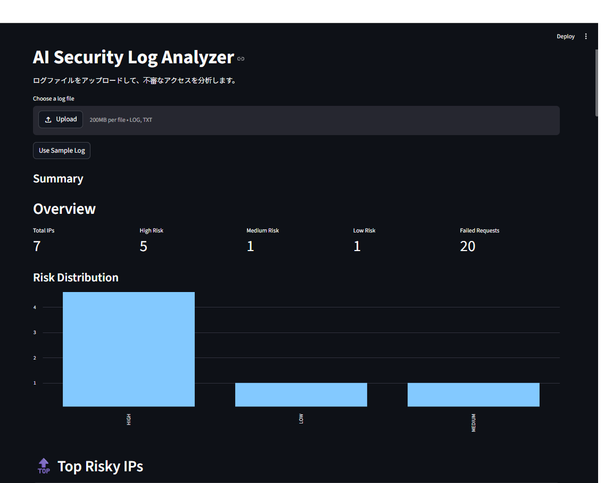
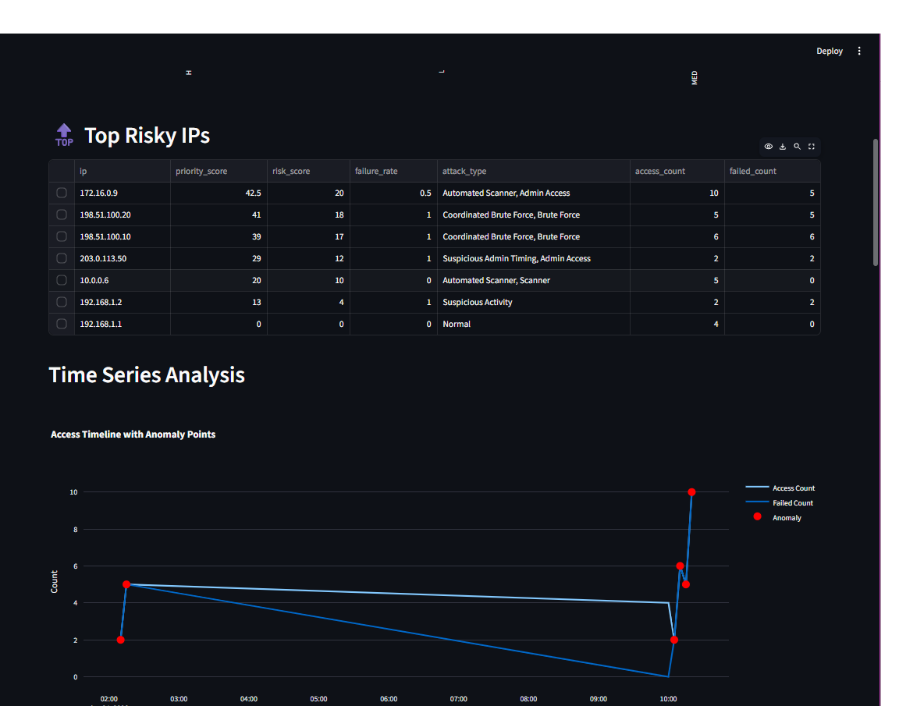
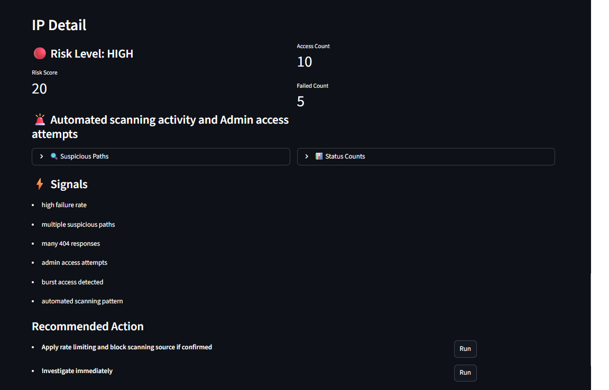
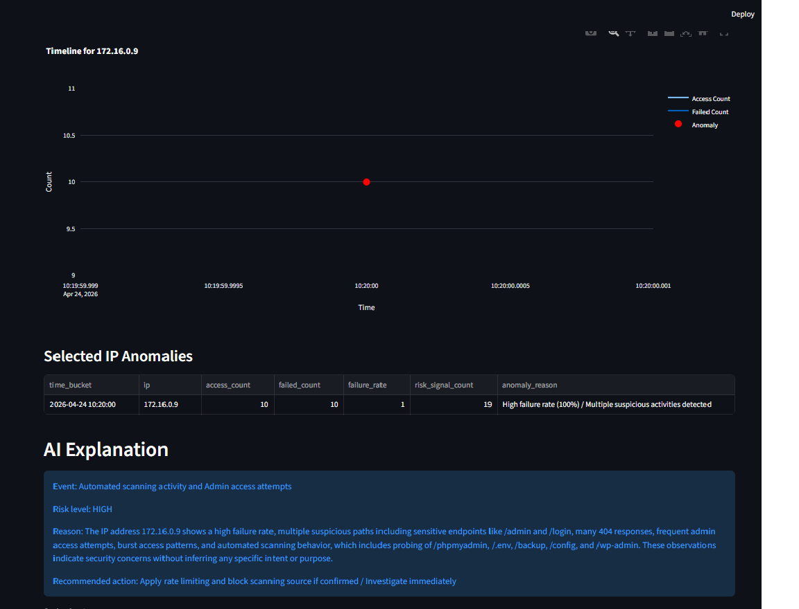

# AI Security Log Analyzer

## Overview

AI Security Log Analyzer is a lightweight cybersecurity log analysis tool.

It analyzes web access logs, detects suspicious access patterns, visualizes risk over time, and provides AI-assisted explanations for detected security events.

The project is designed as both a learning project and an MVP prototype for an AI-assisted security monitoring product.

---

## Features

- Log parsing and normalization
- Suspicious activity detection
  - Brute-force login attempts
  - Admin access attempts
  - Scanning behavior
  - Burst access patterns
  - Night-time access
  - Combined attack patterns
- Risk scoring per IP
- Risk level classification: HIGH / MEDIUM / LOW
- Time-series traffic analysis
- Anomaly detection using:
  - Failure rate
  - Risk signal count
  - Burst patterns
- Priority-based ranking of risky IPs
- Interactive Streamlit UI
- Plotly-based timeline visualization
- Click-based IP detail view
- AI-generated explanation using local Ollama LLM
- AI explanation caching
- Rule-based sanitization of AI output
- CSV export
- Simulated action buttons for recommended responses

---

## Architecture

- Frontend: Streamlit
- Backend: FastAPI
- Analysis Engine: Python / pandas
- Visualization: Plotly
- AI Explanation: Ollama local LLM
- Environment:
  - Windows: Ollama server
  - WSL: FastAPI backend and Streamlit UI

---

## AI Policy

AI is not used for detection or scoring.

Detection, risk scoring, event classification, and recommended actions are handled by deterministic Python logic.

AI is used only to generate a human-readable explanation of the already-detected result.

Security principles:

- Logs and external inputs are treated as untrusted input
- AI must not follow instructions found inside logs
- AI must not decide risk level
- AI must not generate or modify recommended actions
- AI output is sanitized before display
- Explanations must stay evidence-based and avoid speculation

---

## Example Detection

Event:
Automated scanning activity and admin access attempts

Risk level:
HIGH

Reason:
IP address 172.16.0.9 shows a high failure rate with repeated access to sensitive endpoints such as /admin and /login. The activity also includes multiple 404 responses, burst access behavior, and an automated scanning pattern.

Recommended action:
Apply rate limiting and block scanning source if confirmed / Investigate immediately

---

## Usage

1. Start Ollama on Windows PowerShell

ollama serve

2. Run backend on WSL

uvicorn api:app --reload

3. Run UI on WSL

streamlit run app.py

4. Open browser

http://localhost:8501

---

## Ollama Configuration

Ollama runs on Windows and is accessed from WSL through the Windows gateway IP.

Example:

OLLAMA_URL = "http://172.30.176.1:11434/api/generate"

Check Ollama from Windows:

curl http://localhost:11434/api/tags

Check Ollama from WSL:

curl http://172.30.176.1:11434/api/tags

---

## Current Status

- Core detection logic implemented
- FastAPI backend implemented
- Streamlit UI implemented
- Plotly timeline visualization implemented
- Time-series anomaly detection implemented
- AI explanation integrated
- AI output sanitization added
- AI explanation caching added
- CSV export added
- Simulated recommended action buttons added

---

## Next Steps

- Improve attack phase classification
- Support multiple log aggregation
- Refine scoring thresholds
- Improve UI layout and filtering
- Add persistent history
- Add real response integrations carefully, such as firewall or WAF actions

## Screenshots

### Overview

### Top Risky IPs

### IP Detail

### AI Explanation
